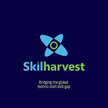

  <table style="margin-left:auto; margin-right:auto; border-collapse: collapse">
    <tr>
      <td align="left" style="border: none">
        
      </td>
      <td align="center" style="border: none">
        <h1>FOOD PRICES ANALYSIS IN NIGERIA (CASE STUDY: 2002-2023)</h1>
      </td>
    </tr>
  </table>

## 
 **TABLE OF CONTENTS** 

1. [Project Overview](#project-overview)
2. [Project Objectives](#project-objectives)
4. [Tools & Technologies Used](#tools--technologies)
5. [Project Structure](#project-structure)
7. [Data Collection](#data-collection)
8. [Data Cleaning & Preprocessing](#data-cleaning--data-preprocessing)
9. [Methodology](#methodology)
10. [Results & Observations](#results--observations)
11. [Recommendations](#recommendations)    
12. [Future Work](#future-work)
13. [References](#references)
14. [Contact Information](#contact-information)
15. [Acknowledgements](#acknowledgements)

## Project Overview
This project analyzes food prices data for Nigeria sourced from the World Food Programme Price Database. The goal is to explore trends, disparities, and factors influencing food prices to provide insights for stakeholders and policymakers.

## Project Objectives
- Identify regional variations in food prices within Nigeria and analyze the factors contributing to these disparities.
- Provide insights for policymakers
- Evaluate food affordability and accessibility
- Compare inflation rates of food commodities of year to year

## Tools & Technologies
- Power BI for data cleaning, analysis and visualization

## Project Structure
- /data: Contains the raw and processed data files
- /visualizations: Contains Power BI visualization files
- /images: Contains images used for creating Github documentations
- /docs: Contains project documentation

## Data Collection
The dataset used for this project contains food prices data for various commodities and regions in Nigeria [Check Datasource](https://data.humdata.org/dataset/wfp-food-prices-for-nigeria). It covers foods such as maize, rice, beans, fish, and sugar for different markets across the country.

  

## Data Cleaning & Data Preprocessing
- Promoted the first row as header and deleted the next row immediately after it
- Renamed the all the columns using sentence case
- Changed the data type for Date the column to a datetime type
- Renamed the second column to State 
- Renamed the third column to LGA
- Changed the data type for latitude and longitude to decimals
- Formatted the last column which - USD price to 2 decimal places.

## Methodology
- Explored trends in food prices over time
- Analyzed regional disparities in food prices
- Identified factors influencing food prices
- Created visualizations to communicate key findings

## Results & Observations
Find below some of the report visualizations:

  

  

  

## INSIGHTS DERIVED
1. The number of states engaging in food production or agriculture saw a significant increase starting from 2015, with a 50% rise observed within 7 months
2. This surge in agricultural activity led to a subsequent increase in food production across the nation, highlighting the direct correlation between state involvement in agriculture and the availability of diverse food items.

  

3. Yobe and Borno states emerged as leaders with the highest count of markets, correlating with their status as top producers of unique food commodities. Each state experienced an impressive 82% increase in market count and food commodity production compared to others.

  

4. Despite being among the least prolific states in terms of food production and market presence, Abia stands out for for its relatively expensive food items compared to other producing states, underscoring its market influence despite limited production volume

  

## Recommendations

|RECOMMENDATIONS|
|---------------|
|1. Conduct further analysis to understand the factors contributing to Abia's high average food prices despite its lower production and market presence. This insight can inform strategies to address affordability challenges and improve access to essential food items in the region.|
|2. Provide targeted support and resources to states like Yobe and Borno, which have emerged as leaders in market count and food commodity production. This can help maximize their potential and further strengthen their contributions to the agricultural sector.|
|3. Implement policies and initiatives that foster agricultural development and investment to sustain the surge in agricultural activity and subsequent food production growth.|

## Future Work
- Create a model to forecast prices of food items in Nigeria
- Refine project visualizations for better insights
- Explore additional datasets for broader analysis
- Collaborate with domain experts for deeper insights

## References
- [World Food Programme Price Database](https://www.wfp.org/prices)

## Contact Information
For inquiries, please contact [Email](sunmolaadeyanju@gmail.com) or connect on [LinkedIn](https://www.linkedin.com/in/sunmolaadeyanju/).

## Acknowledgements
- Special thanks to [Mr. Temidayo](https://www.linkedin.com/in/temidayoayeni/) for his invaluable support and guidance.

